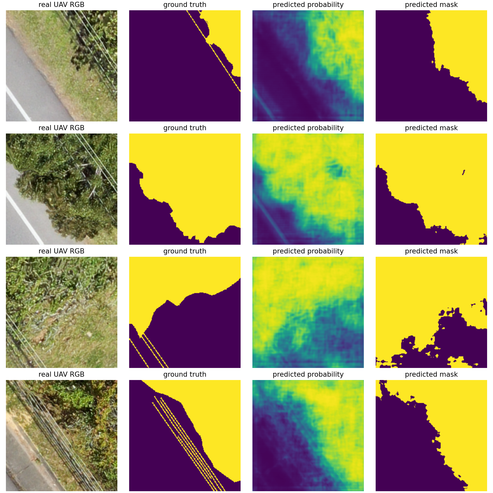
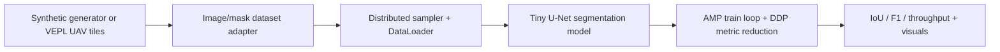
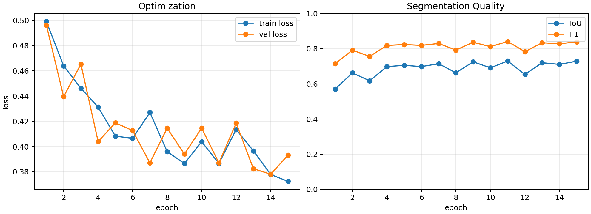

# Multi-GPU Vegetation Risk Vision Pipeline

Distributed computer-vision training pipeline for vegetation-risk segmentation around powerline corridors. The project demonstrates PyTorch `DistributedDataParallel`, mixed precision, reproducible metrics, real UAV dataset validation, and cloud-GPU portability while staying aligned with climate-tech and infrastructure-risk ML use cases.



## Results Snapshot

| dataset | images | resolution | epochs | device | best IoU | final IoU | final F1 | throughput |
|---|---:|---:|---:|---|---:|---:|---:|---:|
| VEPL UAV tiles | 532 | 192px | 15 | RTX 5070 Laptop GPU | 0.7299 | 0.7290 | 0.8392 | 249.1 img/s |

The representative run trains on the compact VEPL UAV tile archive with 426 training samples and 106 validation samples. The model learns a binary foreground mask over vegetation plus powerline/corridor pixels decoded from VEPL's semantic colors.

## Core Idea

Utilities and infrastructure operators need to prioritize vegetation risk around power lines. This project builds a compact segmentation pipeline that learns vegetation and powerline-corridor foreground masks from two complementary settings:

- a deterministic synthetic generator for reproducible distributed-training tests,
- the public VEPL UAV dataset for real-world validation on powerline corridor imagery.

The synthetic path makes DDP and metrics easy to verify anywhere. The VEPL path gives the portfolio result: real aerial RGB tiles, color-decoded semantic masks, quantitative validation, and visual prediction artifacts.

## 10-Second Contribution

- Trains a compact U-Net-style segmentation model on synthetic and real UAV vegetation-risk masks.
- Runs as CPU smoke test, local single-GPU training, or multi-GPU DDP training.
- Uses deterministic splits, rank-aware logging/checkpointing, distributed samplers, AMP, and throughput metrics.
- Produces `metrics.json` and `model.pt` artifacts for each run.
- Includes commit-ready visual outputs and a cloud GPU playbook for Kaggle/Colab/Lightning AI.

## Pipeline



## Representative Real-Data Run

```bash
bash scripts/download_vepl_sample.sh
bash scripts/run_vepl_localai_full.sh
PYTHONPATH=src python scripts/plot_training_curves.py
PYTHONPATH=src python scripts/visualize_vepl_predictions.py \
  --checkpoint artifacts/runs/vepl_localai_full/model.pt \
  --output docs/assets/vepl_predictions_full.png \
  --image-size 192 \
  --base-channels 32 \
  --device cuda
```



## Quick Start

```bash
cd "Learning and building AI skills/07 - Multi-GPU Vegetation Risk Vision Pipeline"
python -m venv .venv
source .venv/bin/activate
pip install -r requirements.txt
bash scripts/run_local_smoke.sh
```

Note: on this local RTX 5070 Laptop GPU, some older PyTorch CUDA builds do not include `sm_120` kernels. The training script detects that case and falls back to CPU for smoke tests. Cloud GPUs such as Kaggle T4/P100 should run on CUDA with a compatible PyTorch build.

## Local Single-GPU Run

```bash
bash scripts/run_localai_gpu.sh
```

This machine's working CUDA environment is the `localai` conda environment. The helper script uses `/home/useradmin/miniconda3/envs/localai/bin/python` by default.

## Real UAV Dataset Test

The recommended real-world validation dataset is **VEPL: Vegetation Encroachment in Power Line Corridors**, an open UAV semantic-segmentation dataset with RGB tiles and masks for vegetation, powerline corridors, and background.

Dataset DOI: <https://doi.org/10.5281/zenodo.7800234>

Download the compact non-augmented tile archive:

```bash
bash scripts/download_vepl_sample.sh
```

Visualize real image/mask samples:

```bash
PYTHONPATH=src python scripts/visualize_vepl_samples.py
```

Run a local GPU smoke training pass on VEPL:

```bash
bash scripts/run_vepl_localai_smoke.sh
```

Run the representative local GPU experiment:

```bash
bash scripts/run_vepl_localai_full.sh
```

This uses the same U-Net, AMP, metrics, and artifact layout as the synthetic experiment, but switches the input pipeline to real UAV imagery with `--dataset vepl`. VEPL masks are decoded by color: black background, green vegetation, and gray powerline/corridor pixels. The default `foreground` target trains a binary mask over vegetation plus powerline/corridor pixels.

Verified representative VEPL result on `localai`:

```text
best_val_iou: 0.7299
final_val_iou: 0.7290
final_val_f1: 0.8392
images_per_sec: 249.1
```

Visual outputs:

```text
docs/assets/vepl_real_samples.png
docs/assets/vepl_predictions_full.png
docs/assets/vepl_training_curves.png
```

## Multi-GPU Run

On a machine with two GPUs, for example Kaggle T4x2:

```bash
export PYTHONPATH=src
bash scripts/run_kaggle_2gpu.sh
```

Equivalent raw command:

```bash
torchrun --standalone --nproc_per_node=2 -m veg_multigpu.train --amp
```

## Compare Runs

```bash
python scripts/compare_runs.py
```

Example output:

```text
| run | world_size | last val_iou | last val_f1 | images/sec |
|---|---:|---:|---:|---:|
| smoke | 1 | 0.1234 | 0.2198 | 180.5 |
| single_gpu | 1 | 0.7421 | 0.8520 | 620.3 |
| kaggle_2gpu | 2 | 0.7480 | 0.8558 | 1110.7 |
```

Local smoke-test verification is documented in [docs/verification.md](docs/verification.md).

## Visualize Predictions

After training:

```bash
PYTHONPATH=src python scripts/visualize_predictions.py \
  --checkpoint artifacts/runs/localai_single_gpu/model.pt \
  --output artifacts/figures/localai_predictions.png
```

The figure shows vegetation intensity, powerline corridor signal, ground-truth risk, predicted probability, and thresholded prediction mask.

## Why This Is Better Than AlexNet

AlexNet shows that you know a historical CNN. This project shows a modern ML engineering capability:

- distributed training,
- segmentation instead of simple classification,
- climate/infrastructure relevance,
- model evaluation,
- reproducible artifacts,
- cloud GPU portability.

## Public vs Private Docs

Public docs are in `README.md` and `docs/`.

Private learning notes live in `private-learning/`, which is ignored by `.gitignore` and should not be committed.
